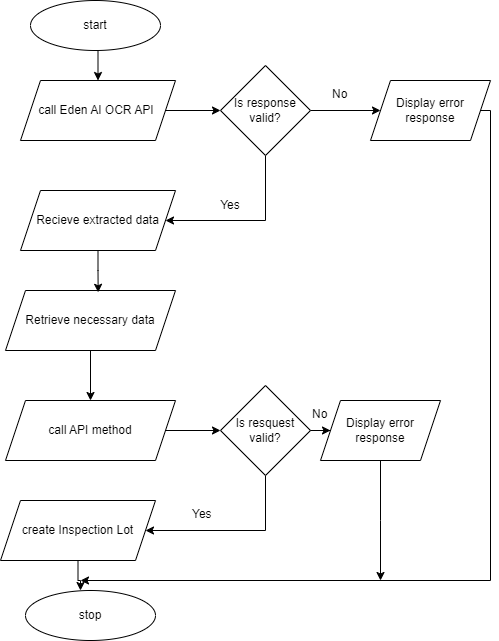

# Extract paper Delivery Note and integrate with S/4HANA

This example illustrates leveraging the `sap.s4hana.api_inspectionlot_srv:Client` in Ballerina for S/4HANA
API interactions. It extracts data from a paper Delivery Note using Optical character recognition (OCR) with [Eden AI](edenai.co) API. The data is then used to establish an inspection lot to initiate the inspection process in the S/4HANA QM module.

The example works as follows:


## Prerequisites

### 1. Setup an Eden AI account

Create an Eden AI account. Generate an API token and save it for later use, as specified in the Configuration section.

### 2. Setup the S/4HANA API

Refer to the [Setup Guide](https://central.ballerina.io/ballerinax/sap/latest#setup-guide) for necessary credentials (
hostname, username, password).

### 2. Configuration

In the example directory, create a Config.toml file and configure InspectionLot and S/4HANA API credentials as shown below:

```toml
[s4hanaClientConfig]
hostname = "<Hostname>"
username = "<Username>"
password = "<Password>"

[<ORG_NAME>.delivery_note_to_inspectionlot]
ocrToken = "<Token>"
invoiceUrl = "<invoiceUrl>"
```

## Run the Example

Execute the following command to run the example:

```bash
bal run
```
The URL of the invoice image is passed as a command-line argument.